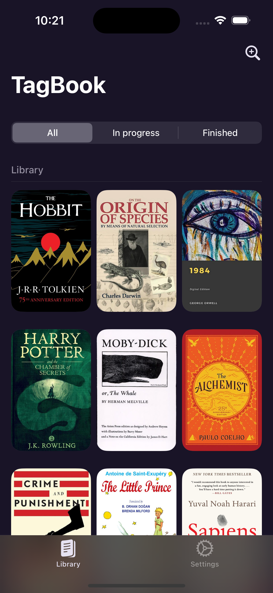
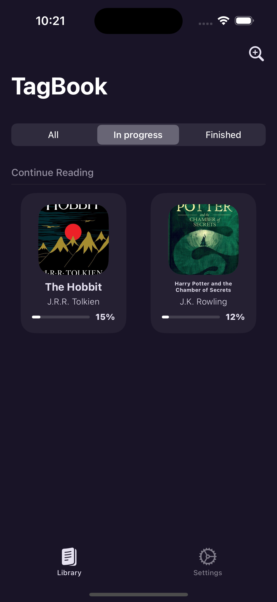
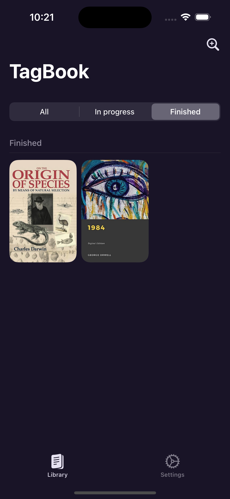
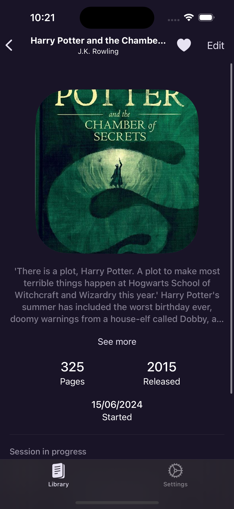
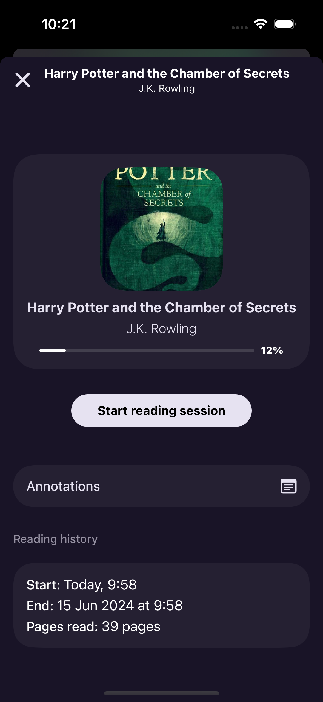

# BookShelve (AKA TagBook)

## Overview

BookShelve is a demo iOS project built using SwiftUI, MVVM architecture, and CoreData. This application helps you create a personal bookshelf by allowing you to search for books using the Google Books API, store your favorite books locally, and track your reading habits through reading sessions.

## Key Features

- **Book Search**: Search for books by title, author, or description using the Google Books API.
- **ISBN Scanning**: Quickly add books to your collection by scanning their ISBN code.
- **Annotations**: Add and manage annotations for each book.
- **Translation**: Translate words while reading books in different languages.

## Future Enhancements

- **Word Storage**: Store and manage words along with their meanings.
- **Book Grouping**: Organize books into categories for better management.
- **Testing**: Implement comprehensive unit and UI tests to ensure app stability and performance.

## Screenshots

## **Library Screen:**

| All                                    | In Progress                                   | Finished                                      |
|----------------------------------------|-----------------------------------------------|-----------------------------------------------|
|           |   |        |

 

## **Detail and Reading Session Screens:**

| Detail                              | Reading Session                              |
|-------------------------------------|----------------------------------------------|
|  |  |

 
